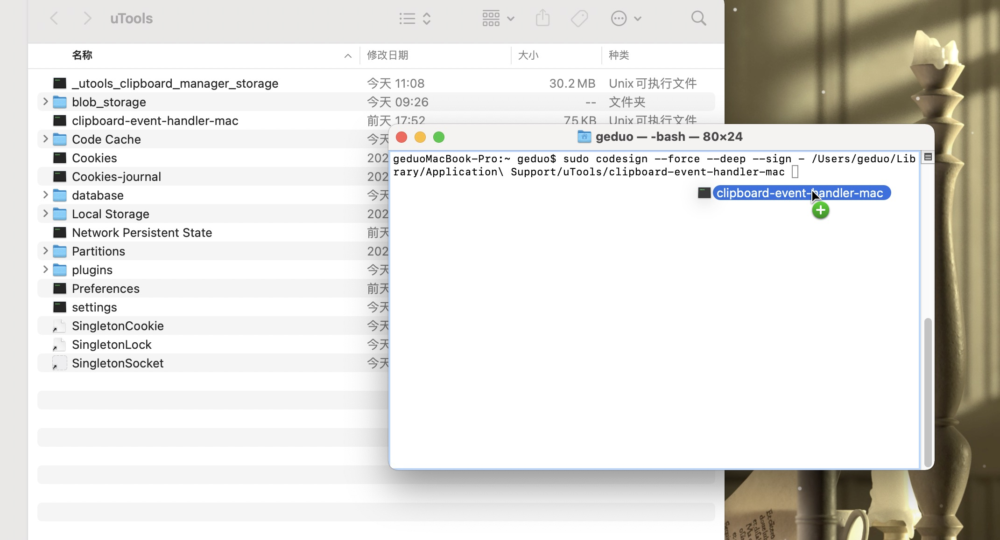
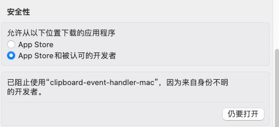
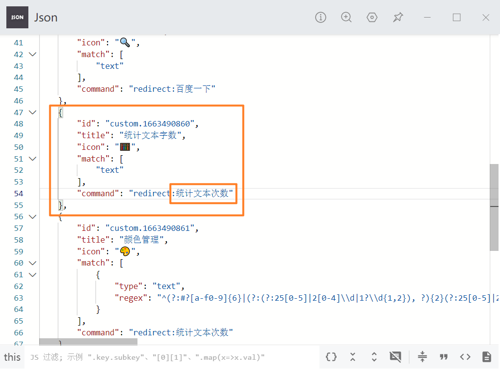

# 使用指南

## 二进制监听程序在 MacOS 的特殊配置

针对`MacOS`系统，在将剪贴板监听程序拷贝到指定目录后，请在重启插件后，检查监听程序是否生效

如果监听程序未生效，可能是：

1. 需要下载对应芯片的监听程序
2. 需要对程序进行签名与授权

::: warning
适配了Apple M1芯片的监听程序： [clipboard-event-handler-mac-apple-silicon-arm64-M1](https://github.com/wangyw6716/clipboard-event-handler-mac-apple-silicon-arm64-M1)

由于此仓库不在超级剪贴板开发者维护范围内，请自行承担文件安全性带来的风险。
:::

**1. 签名**

打开终端输入以下命令

```sh
sudo codesign --force --deep --sign - 
```


然后将此目录中的`clipboard-event-handler-mac`文件拖入终端执行命令



**2. 授权**

左上角🍎 / 系统偏好设置 / 安全性与隐私 / 通用 / 点击允许



## 如何创造自己的功能按钮

超级剪贴板为用户提供了自定义功能按钮的能力

这让`超级剪贴板`真正变得“超级”起来，用户可以通过编写`json`实现**携带数据跳转到任何其他插件**，这项功能给`超级剪贴板`带来了无限可能。

插件中，默认内置了若干使用样例：

- 讯飞OCR识别
- 百度搜索
- 百度识图
- 统计文本字数
- 颜色管理
- 识别图片中二维码
- 上传到图床
- 翻译

下面我将从这些样例出发对这项功能做简单介绍：

这项功能的原理是`utools.redirect()`，在不分离插件的情况下，在不同插件之间的跳转体验是连贯的。

以`百度搜索`为例，是通过`网页快开`提供的关键词实现的，我们可以编写以下json：

```json
{
  "id": "custom.1663490859",
  "title": "百度搜索",
  "icon": "🔍",
  "match": ["text"],
  "command": "redirect:百度一下"
}
```

可以实现从剪贴板直接跳转到`网页快开`，也即打开百度并搜索当前选中的文本内容。

除了使用简单的字符串匹配不同的内容，`超级剪贴板`还支持使用正则表达式，以`上传到图床`功能为例：

```json
{
  "id": "custom.1663490864",
  "title": "上传到图床",
  "icon": "🚀",
  "match": ["image", { "type": "file", "regex": ".(?:jpg|jpeg|png)$" }],
  "command": "redirect:上传到图床"
}
```

这个功能除了可以匹配图片，还可以将符合正则的图片文件匹配上，在匹配上的历史记录上展示`上传到图床`按钮，携带数据跳转到图床插件，一键上传。

需要注意的是，因为自定义功能按钮实现的是**携带数据跳转不同插件**，所以`redirect`后的内容并不应该是普通关键字（普通关键字仅能作为插件入口，而不能携带数据），而应该是`文本`/`图片`/`文件或文件夹`：




- `id`: `String` 全局唯一 必须以`custom`开头 建议以时间戳为后缀
- `title`: `String` 鼠标悬停时展示的文本
- `icon`: `String` 展示在插件内的图标
- `match`: `<String | Object>[]` 匹配模式
- `command`: `String` 执行跳转的关键字 前缀`redirect:`是必须的

在未来的版本更新中，`超级剪贴板`将开放更多自定义功能给高级用户，帮助你更高效率的管理、使用剪贴板。
